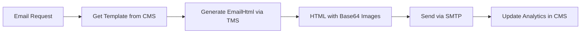
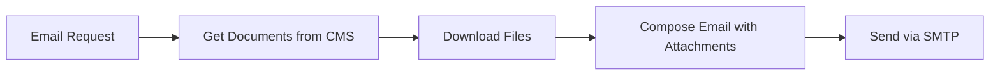
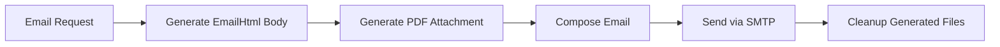

# 📧 Email Service Web API

**Stateless email automation service** that orchestrates TMS and CMS to send template-based emails with attachments. Built with ASP.NET Core 9.0, MailKit, and HTTP clients.

> 📧 **Role**: Email orchestration layer that combines TMS-generated content with CMS document attachments for comprehensive email workflows.

---

## 🏗️ Architecture Role

EmailService operates as a **Pure Orchestrator** in the microservices architecture:

```
┌─────────────────────────────────────────────────────────┐
│                MANTEQ DOCUMENT SYSTEM                   │
├─────────────────────────────────────────────────────────┤
│                                                         │
│  📧 Email Service ────► 🎯 TMS API ────► 📁 CMS API    │
│  (Orchestrator)        (Generator)      (Data Store)    │
│                                                         │
│  • MailKit/SMTP       • EmailHtml       • Documents    │
│  • HTTP Clients       • Base64 Images   • Templates    │
│  • No Database        • Conversion      • File Storage │
│  • Stateless          • HTTP API        • PostgreSQL   │
└─────────────────────────────────────────────────────────┘
                            │
                ┌───────────┴────────────┐
                │   EMAIL WORKFLOW       │
                ├────────────────────────┤
                │ 1️⃣ Get Email Template │
                │ 2️⃣ Generate TMS Body  │
                │ 3️⃣ Attach CMS Docs    │
                │ 4️⃣ Send via SMTP      │
                └────────────────────────┘
```

### **Pure Orchestration Pattern**
- ✅ **No Database**: All data via HTTP APIs
- ✅ **HTTP Clients**: TMS and CMS integration
- ✅ **SMTP Only**: Email sending with MailKit
- ✅ **Stateless**: Can run multiple instances
- ✅ **Resilient**: Polly retry and circuit breaker

---

## 🚀 Key Features

### **📧 Email Template Support**
- ✅ **Multiple Body Types**: Plain text, TMS template, custom HTML
- ✅ **Template Management**: Via CMS email templates API
- ✅ **Property Substitution**: Dynamic placeholder filling
- ✅ **Subject & Body**: Full template control

### **📎 Flexible Attachments**
- ✅ **CMS Documents**: Attach existing documents
- ✅ **TMS Generated**: Generate documents on-the-fly
- ✅ **Custom Files**: Upload custom attachments
- ✅ **Mixed Sources**: Combine all attachment types

### **🔄 TMS Integration**
- ✅ **EmailHtml Generation**: Request HTML from TMS
- ✅ **Base64 Images**: Receive embedded images
- ✅ **Auto-Download**: Single HTTP call
- ✅ **Multiple Formats**: PDF, Word, etc. as attachments

### **📁 CMS Integration**
- ✅ **Document Retrieval**: Download CMS documents
- ✅ **Template Access**: Get email template configs
- ✅ **Custom Templates**: Fetch custom HTML files
- ✅ **Analytics**: Update sent/failure counts

### **📨 SMTP Features**
- ✅ **Multi-Account**: Configure multiple SMTP accounts
- ✅ **MailKit**: Professional email library
- ✅ **HTML & Plain Text**: Both formats supported
- ✅ **CC & BCC**: Full recipient support
- ✅ **Attachments**: Multiple file attachments

### **🛡️ Resilience**
- ✅ **Retry Policy**: 3 retries with exponential backoff
- ✅ **Circuit Breaker**: Prevents cascade failures
- ✅ **Timeout Management**: Configurable timeouts
- ✅ **Error Logging**: Comprehensive error tracking

---

## 📋 Prerequisites

- ✅ **.NET 9.0 SDK**
- ✅ **SMTP Account** (Outlook, Gmail, etc.)
- ✅ **TMS API** running (for content generation)
- ✅ **CMS API** running (for templates & documents)

---

## ⚙️ Configuration

### **📧 SMTP Configuration**

```json
{
  "Email": {
    "Smtp": {
      "Host": "smtp-mail.outlook.com",
      "Port": 587,
      "EnableSsl": true,
      "Username": "your-email@outlook.com",
      "Password": "your-app-password"
    },
    "Accounts": [
      {
        "name": "primary",
        "displayName": "Manteq System",
        "emailAddress": "noreply@manteq-me.com",
        "isDefault": true
      }
    ]
  }
}
```

**Docker Environment Variables**:
```bash
SMTP_HOST=smtp-mail.outlook.com
SMTP_PORT=587
SMTP_ENABLE_SSL=true
SMTP_USERNAME=your-email@outlook.com
SMTP_PASSWORD=your-app-password
```

### **🔗 Service Connections**

```json
{
  "TmsApi": {
    "BaseUrl": "http://localhost:5267",
    "Timeout": "60"
  },
  "CmsApi": {
    "BaseUrl": "http://localhost:5000",
    "Timeout": "30"
  }
}
```

**Docker Environment**:
```bash
TMS_BASE_URL=http://tms-api:5267
CMS_BASE_URL=http://cms-api:5000
```

---

## 🏃‍♂️ Quick Start

### **1. Get SMTP App Password**

**Outlook/Hotmail**:
1. Go to: https://account.microsoft.com/security
2. Enable 2FA
3. Generate App Password for "Mail"
4. Use this password (not your regular password)

**Gmail**:
1. Enable 2FA
2. Go to App Passwords
3. Generate password for "Mail"

### **2. Configure SMTP**

Edit `appsettings.json`:
```json
{
  "Email": {
    "Smtp": {
      "Host": "smtp-mail.outlook.com",
      "Port": 587,
      "EnableSsl": true,
      "Username": "your-email@outlook.com",
      "Password": "your-app-password"
    }
  }
}
```

### **3. Start Dependencies**

```bash
# Ensure TMS and CMS are running
curl http://localhost:5267/health
curl http://localhost:5000/health
```

### **4. Run Email Service**

```bash
cd EmailService.WebApi
dotnet restore
dotnet run
```

**Access Points**:
- 🌐 API: `http://localhost:5030`
- 📖 Swagger: `http://localhost:5030/swagger`
- ✅ Health: `http://localhost:5030/health`

---

## 🌐 API Endpoints

### **📧 Email Sending**

| Method | Endpoint | Description |
|--------|----------|-------------|
| POST | `/api/email/send-with-template` | Send with TMS template |
| POST | `/api/email/send-with-documents` | Send with CMS attachments |
| POST | `/api/email/send-tms-html-and-attachment` | TMS body + TMS attachment |
| POST | `/api/email/test-template` | Test email template |

### **⚙️ Configuration**

| Method | Endpoint | Description |
|--------|----------|-------------|
| GET | `/api/email/accounts` | List configured accounts |
| GET | `/api/email/health` | Service health check |

---

## 📝 API Examples

### **Send with TMS Template (EmailHtml)**

```http
POST /api/email/send-with-template
Content-Type: application/json

{
  "toRecipients": ["customer@example.com"],
  "subject": "Your Policy Documents",
  "templateId": "template-guid",
  "propertyValues": {
    "CustomerName": "John Smith",
    "PolicyNumber": "POL-2025-001",
    "SupportEmail": "support@manteq-me.com"
  },
  "exportFormat": "EmailHtml"
}
```

**Response:**
```json
{
  "emailId": "email-guid",
  "message": "Email sent successfully",
  "status": "Sent",
  "sentAt": "2025-11-18T14:30:00Z"
}
```

### **Send with CMS Document Attachments**

```http
POST /api/email/send-with-documents
Content-Type: application/json

{
  "toRecipients": ["customer@example.com"],
  "ccRecipients": ["manager@example.com"],
  "subject": "Document Delivery",
  "htmlBody": "<p>Please find attached documents.</p>",
  "cmsDocumentIds": [
    "doc-guid-1",
    "doc-guid-2"
  ]
}
```

### **TMS HTML Body + TMS PDF Attachment**

```http
POST /api/email/send-tms-html-and-attachment
Content-Type: application/json

{
  "toRecipients": ["customer@example.com"],
  "subject": "Your Invoice",
  "bodyTemplateId": "email-template-guid",
  "bodyPropertyValues": {
    "CustomerName": "John Smith",
    "InvoiceNumber": "INV-2025-001"
  },
  "attachmentTemplateId": "invoice-template-guid",
  "attachmentPropertyValues": {
    "CustomerName": "John Smith",
    "InvoiceNumber": "INV-2025-001",
    "Amount": "1,250.00"
  },
  "attachmentExportFormat": "Pdf"
}
```

### **Test Email Template**

```http
POST /api/email/test-template
Content-Type: application/json

{
  "templateId": "email-template-guid",
  "toRecipients": ["test@example.com"],
  "tmsBodyPropertyValues": {
    "CustomerName": "Test User"
  },
  "tmsAttachmentPropertyValues": {
    "0": {
      "CustomerName": "Test User",
      "DocumentNumber": "DOC-001"
    }
  }
}
```

---

## 🎯 Email Workflows

### **Workflow 1: TMS EmailHtml (Primary)**



**Use Case**: Customer communications, notifications, reports

### **Workflow 2: CMS Document Attachments**



**Use Case**: Sending existing documents, invoices, contracts

### **Workflow 3: TMS Body + TMS Attachment**



**Use Case**: Invoice emails with PDF attachments

---

## 🐳 Docker Deployment

### **Dockerfile** (provided)

```dockerfile
FROM mcr.microsoft.com/dotnet/aspnet:9.0 AS base
RUN apt-get update && apt-get install -y curl
WORKDIR /app
EXPOSE 5030

# Build stages...

ENTRYPOINT ["dotnet", "EmailService.WebApi.dll"]
```

### **Docker Compose Integration**

```yaml
services:
  email-service:
    build:
      context: .
      dockerfile: EmailService.WebApi/Dockerfile
    environment:
      - Email__Smtp__Host=${SMTP_HOST}
      - Email__Smtp__Port=${SMTP_PORT}
      - Email__Smtp__Username=${SMTP_USERNAME}
      - Email__Smtp__Password=${SMTP_PASSWORD}
      - TmsApi__BaseUrl=http://tms-api:5267
      - CmsApi__BaseUrl=http://cms-api:5000
    ports:
      - "5030:5030"
    depends_on:
      - tms-api
      - cms-api
```

---

## 🧪 Testing

### **Health Check**

```bash
curl http://localhost:5030/health

# Response
{
  "status": "healthy",
  "service": "EmailService.WebApi",
  "timestamp": "2025-11-18T10:00:00Z"
}
```

### **Test Email**

```bash
curl -X POST http://localhost:5030/api/email/send-with-template \
  -H "Content-Type: application/json" \
  -d '{
    "toRecipients": ["test@example.com"],
    "subject": "Test Email",
    "templateId": "template-guid",
    "propertyValues": {
      "CustomerName": "Test User"
    },
    "exportFormat": "EmailHtml"
  }'
```

---

## 🔧 Development

### **Project Structure**

```
EmailService.WebApi/
├── Controllers/
│   └── EmailController.cs             # Email API endpoints
├── Services/
│   ├── EmailSendingService.cs         # Main email logic
│   ├── CmsIntegrationService.cs       # CMS HTTP client
│   ├── TmsIntegrationService.cs       # TMS HTTP client
│   └── EmailTemplateIntegrationService.cs  # Template access
├── HttpClients/
│   ├── CmsApiClient.cs                # CMS API client
│   └── TmsApiClient.cs                # TMS API client
├── Models/
│   ├── EmailModels.cs                 # Request/response models
│   └── EmailTemplateDto.cs            # Template DTOs
├── Infrastructure/
│   └── EmailServiceApplicationModelProvider.cs  # Filter setup
├── Program.cs                         # Startup with Polly
└── Dockerfile                         # Docker configuration
```

### **Key Dependencies**

```xml
<PackageReference Include="MailKit" Version="4.3.0" />
<PackageReference Include="MimeKit" Version="4.3.0" />
<PackageReference Include="Polly" Version="8.0.0" />
<PackageReference Include="Polly.Extensions.Http" Version="3.0.0" />
```

---

## 🛡️ Resilience Patterns

### **Retry Policy**

```csharp
// 3 retries with exponential backoff
.WaitAndRetryAsync(3, retryAttempt => 
    TimeSpan.FromSeconds(Math.Pow(2, retryAttempt)))
```

### **Circuit Breaker**

```csharp
// Open after 5 failures, keep open for 30 seconds
.CircuitBreakerAsync(5, TimeSpan.FromSeconds(30))
```

### **Timeout Management**

```json
{
  "TmsApi": { "Timeout": "60" },  // TMS operations slower
  "CmsApi": { "Timeout": "30" }   // CMS operations faster
}
```

---

## 📞 Support

- **Repository**: https://github.com/SalehShalab87/Manteq-doc-system
- **Lead Developer**: Saleh Shalab
- **Email**: salehshalab2@gmail.com

---

## ✅ Production Ready

🎉 **Email Service is fully operational and production-ready!**

**✅ Core Features**:
- Template-based email sending
- TMS EmailHtml generation integration
- CMS document attachment support
- Multi-account SMTP configuration
- Resilient HTTP communication

**✅ Microservices Integration**:
- HTTP clients with Polly resilience
- Stateless architecture
- Independent scaling
- Docker support with health checks

🚀 **Orchestrates TMS and CMS to deliver powerful email automation!**