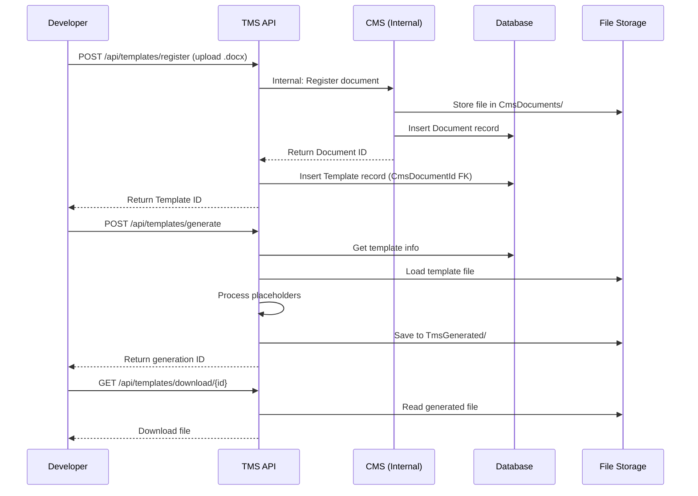
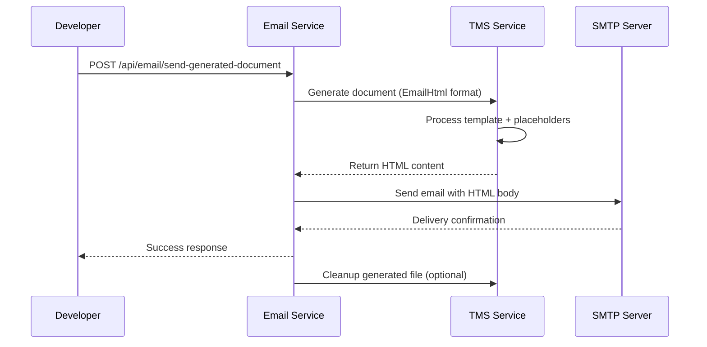

**Complete guide for developers working with the Manteq Document Automation Platform**

## 🎯 **What This System Does**

The Manteq Document System is a **microservices-based platform** that automates document processing and email delivery. It consists of three main services that work together:

1. **📁 CMS (Content Management System)** - Stores and manages documents
2. **🎯 TMS (Template Management System)** - Processes templates and generates documents  
3. **📧 Email Service** - Sends emails using generated content from TMS

## 🏗️ **Architecture Overview**

```
┌─────────────────────────────────────────────────────────────┐
│                    MANTEQ DOCUMENT SYSTEM                   │
├─────────────────────────────────────────────────────────────┤
│  📁 CMS API          🎯 TMS API          📧 Email Service   │
│  localhost:5000      localhost:5267      localhost:5030     │
│                                                             │
│  • Document Storage  • Template Engine   • SMTP Integration │
│  • File Management   • Format Conversion • TMS Integration  │
│  • Database Access   • Placeholder Fill  • CMS Integration  │
└─────────────────────────────────────────────────────────────┘
                              │
                    ┌─────────┴─────────┐
                    │ SHARED RESOURCES  │
                    ├───────────────────┤
                    │ • CmsDatabase_Dev │
                    │ • Shared Storage  │
                    │ • LibreOffice     │
                    └───────────────────┘
```

## 📋 **Development Environment Setup**

### **1. Prerequisites**
- ✅ .NET 9.0 SDK
- ✅ SQL Server Express (SQLEXPRESS instance)
- ✅ LibreOffice (for document conversion)
- ✅ Visual Studio Code or Visual Studio
- ✅ Git

### **2. Quick Setup (5 Minutes)**

```powershell
# 1. Clone the repository
git clone https://github.com/SalehShalab87/Manteq-doc-system.git
cd Manteq-doc-system

# 2. Create shared storage directories
New-Item -ItemType Directory -Path "C:\ManteqStorage_Shared\CmsDocuments" -Force
New-Item -ItemType Directory -Path "C:\ManteqStorage_Shared\TmsGenerated" -Force  
New-Item -ItemType Directory -Path "C:\ManteqStorage_Shared\TmsTemp" -Force
New-Item -ItemType Directory -Path "C:\ManteqStorage_Shared\EmailAttachments" -Force

# 3. CRITICAL: Setup Environment Variables (Required for Database Connection)
# Create .env files for each service with your database configuration
$envContent = @"
DB_SERVER=YOUR_SERVER\SQLEXPRESS
DB_DATABASE=CmsDatabase_Dev  
DB_INTEGRATED_SECURITY=true
DB_TRUST_SERVER_CERTIFICATE=true
"@

$envContent | Out-File -FilePath "CMS.WebApi\.env" -Encoding UTF8
$envContent | Out-File -FilePath "TMS.WebApi\.env" -Encoding UTF8  
$envContent | Out-File -FilePath "EmailService.WebApi\.env" -Encoding UTF8

Write-Host "⚠️  IMPORTANT: Update YOUR_SERVER in each .env file with your actual server name!"

# 4. Build the solution
dotnet build ManteqDocumentSystem.sln

# 5. Start all services (3 terminals)
# Terminal 1: CMS
cd CMS.Webapi; dotnet run

# Terminal 2: TMS  
cd TMS.WebApi; dotnet run

# Terminal 3: Email Service
cd EmailService.WebApi; dotnet run
```

### **3. Environment Variables Configuration (CRITICAL)**

**🔒 Security Note: All database credentials are stored in `.env` files - NEVER put them in appsettings.json!**

Each service directory must have a `.env` file:

**File: `CMS.WebApi/.env`**
```env
DB_SERVER=YOUR_SERVER\SQLEXPRESS
DB_DATABASE=CmsDatabase_Dev  
DB_INTEGRATED_SECURITY=true
DB_TRUST_SERVER_CERTIFICATE=true
```

**File: `TMS.WebApi/.env`**
```env  
DB_SERVER=YOUR_SERVER\SQLEXPRESS
DB_DATABASE=CmsDatabase_Dev  
DB_INTEGRATED_SECURITY=true
DB_TRUST_SERVER_CERTIFICATE=true
```

**File: `EmailService.WebApi/.env`**
```env
DB_SERVER=YOUR_SERVER\SQLEXPRESS
DB_DATABASE=CmsDatabase_Dev  
DB_INTEGRATED_SECURITY=true
DB_TRUST_SERVER_CERTIFICATE=true
```

**How to find YOUR_SERVER:**
- Open SQL Server Management Studio
- Look at the server name when connecting (e.g., `DESKTOP-ABC123\SQLEXPRESS`)
- Or run in PowerShell: `Get-WmiObject -Class Win32_ComputerSystem | Select-Object Name`

### **4. Database Setup**

The system uses a **shared database** for all services:

```sql
-- Create database (if it doesn't exist)
CREATE DATABASE CmsDatabase_Dev;

-- Tables are created automatically via Entity Framework migrations
-- When you start CMS for the first time
```

**Connection String Configuration:**
All services use the same database with different contexts:
- **CMS**: Manages Documents table
- **TMS**: Manages Templates table with foreign key to CMS Documents

### **4. Storage Architecture**

```
C:\ManteqStorage_Shared\
├── CmsDocuments\           # 📁 Permanent document storage (CMS)
│   └── *.docx files        # Original documents & templates
├── TmsGenerated\           # 🎯 Temporary generated files (TMS)
│   └── *.docx/*.html       # Auto-cleaned every 15 minutes
├── TmsTemp\                # 🎯 Working directory (TMS)
│   └── temp files          # Processing workspace
└── EmailAttachments\       # 📧 Email attachments (future use)
    └── email files         # Temporary email files
```

## 🔧 **Service Configurations**

### **CMS Configuration** (`CMS.WebApi/appsettings.json`)
```json
{
  "FileStorage": {
    "Path": "C:\\ManteqStorage_Shared\\CmsDocuments"
  }
}
```

### **TMS Configuration** (`TMS.WebApi/appsettings.json`)
```json
{
  "FileStorage": {
    "Path": "C:\\ManteqStorage_Shared\\CmsDocuments"  // For internal CMS services
  },
  "TMS": {
    "DocumentRetentionHours": 0.25,        // 15 minutes retention
    "CleanupIntervalMinutes": 5,           // Cleanup every 5 minutes
    "MaxFileSizeMB": 100,
    "SharedStoragePath": "C:\\ManteqStorage_Shared\\TmsGenerated",
    "TempUploadPath": "C:\\ManteqStorage_Shared\\TmsTemp"
  }
}
```

### **Email Service Configuration** (`EmailService.WebApi/appsettings.json`)
```json
{
  "EmailSettings": {
    "DefaultFromEmail": "noreply@manteq-me.com",
    "DefaultFromName": "Manteq System"
  }
}
```

## 🌐 **API Endpoints Reference**

### **📁 CMS APIs (Port 5000)**
```http
# Upload and register documents
POST http://localhost:5000/api/documents/register
Content-Type: multipart/form-data

# Get document metadata
GET http://localhost:5000/api/documents/{documentId}

# Download document file
GET http://localhost:5000/api/documents/{documentId}/download
```

### **🎯 TMS APIs (Port 5267)**
```http
# Register template (creates document in CMS internally)
POST http://localhost:5267/api/templates/register
Content-Type: multipart/form-data

# Generate document from template
POST http://localhost:5267/api/templates/generate
Content-Type: application/json
{
  "templateId": "guid",
  "propertyValues": {
    "CustomerName": "John Doe",
    "PolicyNumber": "POL-123456"
  },
  "exportFormat": "EmailHtml",
  "generatedBy": "Developer"
}

# Download generated document
GET http://localhost:5267/api/templates/download/{generationId}
```

### **📧 Email Service APIs (Port 5030)**
```http
# Send email with TMS-generated content
POST http://localhost:5030/api/email/send-generated-document
Content-Type: application/json
{
  "to": ["recipient@example.com"],
  "subject": "Generated Document",
  "templateId": "guid",
  "propertyValues": {
    "CustomerName": "John Doe"
  },
  "exportFormat": "EmailHtml"
}

# Health check
GET http://localhost:5030/api/email/health
```

## 🛠️ **Development Workflows**

### **Workflow 1: Template Processing**



### **Workflow 2: Email Automation**



## 🧪 **Testing and Debugging**

### **Testing Individual Services**

**1. Test CMS:**
```powershell
# Upload a document
curl -X POST "http://localhost:5000/api/documents/register" `
     -F "file=@test-document.docx" `
     -F "description=Test document"
```

**2. Test TMS:**
```powershell
# Register template
curl -X POST "http://localhost:5267/api/templates/register" `
     -F "file=@Email_Template.docx" `
     -F "name=Email Template" `
     -F "description=Customer email template"
```

**3. Test Email Service:**
```powershell
# Health check
curl http://localhost:5030/api/email/health
```

### **Common Issues and Solutions**

**❌ Service won't start - Port conflicts:**
```powershell
# Check what's using the ports
netstat -ano | findstr ":5000"
netstat -ano | findstr ":5267"
netstat -ano | findstr ":5030"

# Kill processes if needed
taskkill /PID <process-id> /F
```

**❌ Database connection errors:**
```sql
-- Verify SQL Server is running
SELECT @@VERSION

-- Check database exists
SELECT name FROM sys.databases WHERE name = 'CmsDatabase_Dev'
```

**❌ File storage errors:**
```powershell
# Verify storage directories exist
Test-Path "C:\ManteqStorage_Shared\CmsDocuments"
Test-Path "C:\ManteqStorage_Shared\TmsGenerated"

# Check permissions
Get-Acl "C:\ManteqStorage_Shared"
```

## 📊 **Monitoring and Logging**

### **Log Locations**
- **Console Output**: Real-time logging during development
- **Debug Output**: Detailed TMS processing logs
- **Error Logs**: Exception details and stack traces

### **Key Log Messages to Watch**
```
📅 TMS Settings: Retention=0.25h, Cleanup every 5min, MaxSize=100MB
🧹 Cleaned up X expired generated documents
📄 Document generation completed successfully
📧 Email sent successfully to recipient@example.com
```

### **Performance Monitoring**
- **TMS Cleanup**: Every 5 minutes, removes files older than 15 minutes
- **File Sizes**: Monitor TmsGenerated directory size
- **Database Growth**: Track Documents and Templates table sizes

## 🔒 **Security Best Practices**

### **Configuration Security**
- ✅ Database uses Integrated Security (Windows Authentication)
- ✅ No credentials in appsettings.json files
- ✅ File storage in dedicated shared directory
- ✅ SMTP credentials should be in environment variables (future)

### **API Security**
- ✅ Input validation on all endpoints
- ✅ File type restrictions (.docx, .xlsx, .pptx only)
- ✅ File size limits (100MB max)
- ✅ Automatic cleanup of temporary files

## 📈 **Scaling Considerations**

### **Current Limitations**
- Single SQL Server instance
- Local file storage
- In-memory generated document tracking

### **Production Scaling Options**
1. **Database**: SQL Server clustering or Azure SQL
2. **File Storage**: Azure Blob Storage or shared NAS
3. **Load Balancing**: Multiple service instances
4. **Caching**: Redis for generated document metadata

## 🚀 **Deployment Guide**

### **Development Deployment**
```powershell
# Build all services
dotnet publish ManteqDocumentSystem.sln -c Release

# Deploy to local IIS or run as services
dotnet run --project CMS.WebApi --environment Production
dotnet run --project TMS.WebApi --environment Production  
dotnet run --project EmailService.WebApi --environment Production
```

### **Production Checklist**
- [ ] ✅ Create `.env` files with production database credentials
- [ ] ✅ Update SMTP settings in EmailService `.env` file
- [ ] ✅ Set up SSL certificates for HTTPS
- [ ] ✅ Configure shared storage backup strategy
- [ ] ✅ Set up monitoring and alerting
- [ ] ✅ Configure log aggregation

## ❌ **Troubleshooting Common Issues**

### **🔒 Environment Variable Problems**
**Problem**: "Database connection failed" or "SQL Server does not exist"
**Solution**: 
```powershell
# 1. Check if .env files exist in each service directory
Test-Path "CMS.WebApi\.env"
Test-Path "TMS.WebApi\.env"  
Test-Path "EmailService.WebApi\.env"

# 2. Verify server name in .env files
# Get your SQL Server instance name:
Get-WmiObject -Class Win32_ComputerSystem | Select-Object Name
# Update DB_SERVER in all .env files with: YourComputerName\SQLEXPRESS

# 3. Test SQL connection manually:
sqlcmd -S "YourComputerName\SQLEXPRESS" -E -Q "SELECT @@VERSION"
```

### **📁 File Storage Issues**
**Problem**: "Directory not found" or "Access denied"
**Solution**:
```powershell
# Create missing directories
New-Item -ItemType Directory -Path "C:\ManteqStorage_Shared\CmsDocuments" -Force
New-Item -ItemType Directory -Path "C:\ManteqStorage_Shared\TmsGenerated" -Force  
New-Item -ItemType Directory -Path "C:\ManteqStorage_Shared\TmsTemp" -Force

# Fix permissions if needed
icacls "C:\ManteqStorage_Shared" /grant Everyone:F /T
```

### **🌐 Service Connection Issues**
**Problem**: Services can't communicate with each other
**Solution**:
```powershell
# Check if services are running on correct ports
netstat -ano | findstr ":5000"    # CMS should be here
netstat -ano | findstr ":5267"    # TMS should be here  
netstat -ano | findstr ":5030"    # Email should be here
```

**⚠️ CRITICAL: Never put database credentials in appsettings.json files! Always use .env files for security.**

## 🤝 **Development Team Guidelines**

### **Code Standards**
- ✅ Follow .NET naming conventions
- ✅ Use dependency injection for services
- ✅ Implement proper error handling with logging
- ✅ Write unit tests for business logic
- ✅ Document public APIs with XML comments

### **Git Workflow**
```bash
# Create feature branch
git checkout -b feature/new-email-template

# Make changes and commit
git add .
git commit -m "Add support for PowerPoint templates"

# Push and create pull request
git push origin feature/new-email-template
```

### **Database Changes**
```bash
# Add EF migrations for schema changes
cd CMS.WebApi
dotnet ef migrations add NewFeature
dotnet ef database update
```

## 📞 **Support and Resources**

### **Documentation**
- **Main README**: System overview and quick start
- **CMS README**: Content Management System details
- **TMS README**: Template Management System details  
- **Email README**: Email Service documentation

### **Quick Links**
- 🌐 **CMS Swagger**: http://localhost:5000/swagger
- 🎯 **TMS Swagger**: http://localhost:5267/swagger  
- 📧 **Email Swagger**: http://localhost:5030/swagger
- 📊 **Database**: Connect to `.\SQLEXPRESS\CmsDatabase_Dev`

### **Contact**
- **Lead Developer**: Saleh Shalab (salehshalab2@gmail.com)
- **Repository**: https://github.com/SalehShalab87/Manteq-doc-system
- **Issues**: Use GitHub Issues for bug reports and feature requests

---

## 🎉 **You're Ready to Go!**

This system is **production-ready** and fully tested. Each service can run independently, and they integrate seamlessly for complete document automation workflows.

**Happy coding! 🚀**
